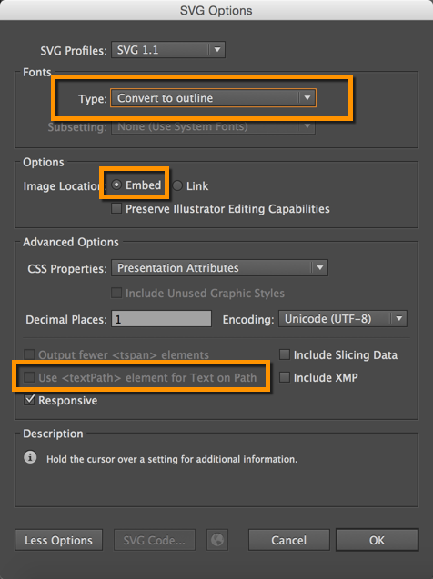

You embed an image the same way you embed other files or assets: you put the file into a folder, and then link to that file. 

Put images inside the `images` folder in your root directory. You can create subdirectories inside this directory. Although you could use Markdown syntax for images, the HTML syntax is probably easier:


```html

```


And the result:


Here's the same Markdown syntax:

```

```

And the result:


## SVG Images

You can also embed SVG graphics. If you use SVG, you need to use the HTML syntax so that you can define a width/container for the graphic. Here's a sample embed:

```html

```

Here's the result:


SVG images will expand to the size of their artboard, so you can either set the artboard the right size when you create the graphic in Illustrator, or you can set an inline style that confines the size to a certain width as shown in the code above.

Also, if you're working with SVG graphics, note that Firefox does not support SVG fonts. In Illustrator, when you do a Save As with your AI file and choose SVG, to preserve your fonts, in the Font section, select "Convert to outline" as the Type (don't choose SVG in the Font section).

Also, remove the check box for "Use textpath element for text on a path". And select "Embed" rather than "Link." The following screenshot shows the settings I use. Your graphics will look great in Firefox.




